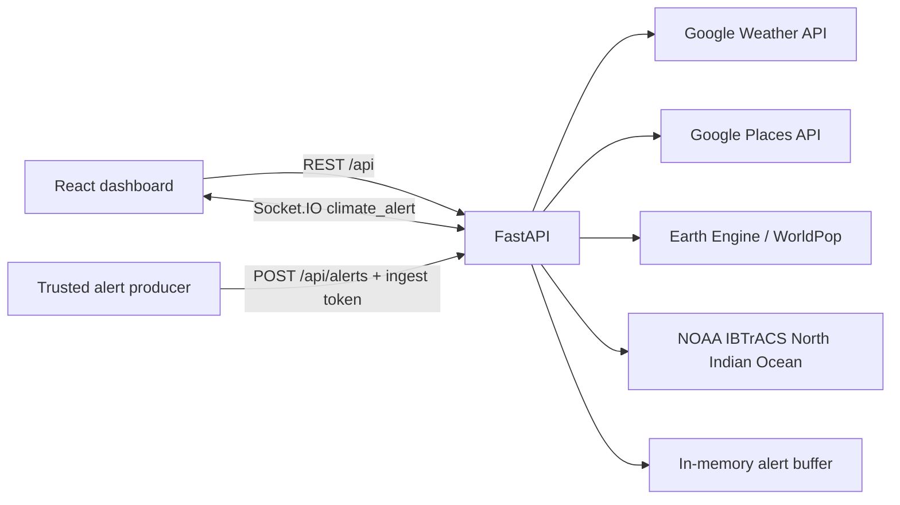

# CIIVF Digital Twin: Project Overview

**Audience:** project reviewers and developers  
**Snapshot:** 2026-09-27

## Purpose

CIIVF is a coastal climate-risk dashboard prototype. It combines regional weather, nearby facilities, population estimates, cyclone-track history, and a live climate-alert feed. It is a decision-support prototype, not an official warning service or a replacement for government emergency systems.

## Architecture

The frontend obtains region metadata and dashboard data from FastAPI. Provider credentials and external-service failures are handled on the backend. New alerts are accepted from a trusted producer, broadcast to connected browsers, and retained in a bounded in-memory list for the current backend process.

## Technology Stack

| Area | Technology |
| --- | --- |
| Frontend | React 19, TypeScript 7, Vite 8, Tailwind CSS 4 |
| Geographic map | Leaflet, React Leaflet, OpenStreetMap tiles |
| Live alerts | `socket.io-client` and Python Socket.IO over ASGI |
| Backend API | Python, FastAPI, Pydantic, Uvicorn |
| Weather and facilities | Google Weather API and Google Places API (New) |
| Population | Google Earth Engine and WorldPop |
| Cyclone history | NOAA IBTrACS North Indian Ocean CSV, cached in-process for six hours |
| Other | Lucide icons, `requests`, `python-dotenv`; Gemini SDK is used by the model-list utility |

Some frontend packages declared in `package.json` (including Express, frontend dotenv, Google GenAI, and Motion) are not imported by the active dashboard. Confirm whether they are needed by an external/AI Studio workflow before removing them.

## Module Map

| Path | Responsibility |
| --- | --- |
| `CIIVF-Frontend/src/App.tsx` | Region selection, API loading, page navigation, and dashboard composition |
| `CIIVF-Frontend/src/api.ts` | Typed REST contracts and requests |
| `CIIVF-Frontend/src/climateAlerts.ts`, `useClimateAlerts.ts` | Alert contracts, REST snapshot, Socket.IO connection, unread state |
| `CIIVF-Frontend/src/components/MapComponent.tsx` | OpenStreetMap basemap and coordinate-based facility markers |
| `CIIVF-Frontend/src/components/HistoricalDisastersView.tsx` | NOAA-backed cyclone track history |
| `CIIVF-Frontend/src/components/ClimateAlertInbox.tsx` | Alert list and detail view |
| `CIIVF-Backend/whatsapp.py` | Twilio Verify OTP, rate-limited SQLite subscriber registry, and WhatsApp template sender |
| `CIIVF-Frontend/src/components/modes/`, `src/data/mockData.ts` | Legacy/demo workflow components; non-overview workflows are not connected in the active app |
| `CIIVF-Backend/server.py` | FastAPI routes, alert validation/ingest, Socket.IO ASGI wrapper |
| `CIIVF-Backend/ingestion_layer/constant.py` | Region names, map bounds, coordinates, and history search radius |
| `CIIVF-Backend/ingestion_layer/weather.py` | Google current conditions and seven-day forecast normalization |
| `CIIVF-Backend/ingestion_layer/places.py` | Google Places searches, diagnostics, and strict 5 km result filtering |
| `CIIVF-Backend/ingestion_layer/population.py` | Earth Engine WorldPop population query |
| `CIIVF-Backend/ingestion_layer/disaster_history.py` | NOAA download, region-distance filtering, and six-hour cache |
| `CIIVF-Backend/ingestion_layer/gee.py` | Earth Engine setup and Sentinel-1 SAR image retrieval |
| `CIIVF-Backend/ingestion_layer/index.py` | Batch ingestion script that writes files under `data/ingested`; not called by the HTTP API |
| `CIIVF-Backend/utils/list_models.py` | Optional Gemini model-listing utility |

## Completed

- Replaced the active dashboard's primary location, forecast, facility, current-condition, and history data paths with backend responses.
- Added ten selectable regions: Visakhapatnam, Puri/Odisha, Chennai, Sundarbans, Saurashtra, Paradip, Gopalpur, Kakinada, Mumbai, and a Bay of Bengal monitoring zone.
- Added invalid-region validation rather than silently reusing Visakhapatnam coordinates.
- Replaced the schematic map with a Leaflet map and added real-coordinate facility markers. Places results are filtered to the selected point's five-kilometre radius.
- Corrected Google Weather field normalization for localized descriptions and Celsius values.
- Replaced generated/static cyclone history with source-attributed NOAA IBTrACS track observations, including observed wind and closest approach. Surge is shown as unavailable because this dataset has no surge measurements.
- Added alert REST history, token-protected alert ingestion, Socket.IO broadcasts, alert badges, and alert details.
- Added optional Twilio WhatsApp phone verification, verified subscribe/opt-out, SQLite subscriber storage, and approved-template sends for newly ingested alerts.
- Added clear diagnostics for missing provider data and removed misleading population/forecast/history fallback values from active API paths.
- Added separate frontend/backend `.gitignore` files and setup documentation.

## Current Limitations

- Population requires a configured Earth Engine project and authenticated account. Without it, the dashboard reports the provider error.
- Google Weather and Places require the corresponding APIs enabled, billing/restrictions configured, and a valid server-side key. Facility availability varies by place; an offshore region correctly may have no nearby facilities.
- The backend has no automatic hazard detector or official agency/sensor alert producer. Socket.IO transports alerts; it does not discover hazards itself.
- Alert storage is in memory (maximum 500) and is lost on restart. There is no durable database, alert acknowledgement, or delivery audit system.
- WhatsApp requires Twilio Verify and Messaging credentials plus an approved WhatsApp Content Template. It remains optional; the dashboard alert feed works independently. Verified subscriber numbers are stored in a local SQLite file under the ignored `.local/` directory.
- Official warnings, validated risk scoring, evacuation routes, task dispatch, rescue coordination, insurance claims, and production GIS hazard layers are not backed by live APIs. Non-overview workflows are intentionally marked unavailable.
- Frontend login/profile is local prototype state; it is not authentication or authorization.
- Development CORS includes permissive origins. Production must restrict origins and protect read APIs and alert ingestion appropriately.

## Developer Handoff / Remaining Tasks

1. Configure and verify provider credentials in each environment; authenticate Earth Engine and enable the required Google APIs.
2. Select and connect an authoritative alert producer (for example, an approved weather agency feed or sensor gateway) that submits validated records to `POST /api/alerts`.
3. Add durable storage for alert records, acknowledgements, and delivery audit/status; WhatsApp subscriber storage is currently local SQLite while alerts remain in memory.
4. Configure Twilio credentials and an approved WhatsApp template, test with the Twilio Sandbox or approved sender, then monitor provider delivery/errors. Keep opt-in optional.
5. Add backend endpoints and frontend integrations for official warnings, risk methodology, routes, tasks, and operational workflows before enabling those screens.
6. Add automated tests for API contracts, provider failures, region filtering, alert authorization, Socket.IO delivery, and frontend location switching.
7. Define production operations: deployment, restricted CORS, authentication, rate limits, monitoring, database backups, and a tile-provider policy for the map.
8. Consider scheduled NOAA ingestion/persistent caching; the first cold history request downloads the North Indian Ocean archive and the current cache is process-local.
9. Review and remove or document unused frontend dependencies and legacy mock/demo files once any external tooling requirements are known.

## Run Guides

- [Frontend setup and development guide](CIIVF-Frontend/README.md)
- [Backend setup, API, and provider guide](CIIVF-Backend/README.md)
