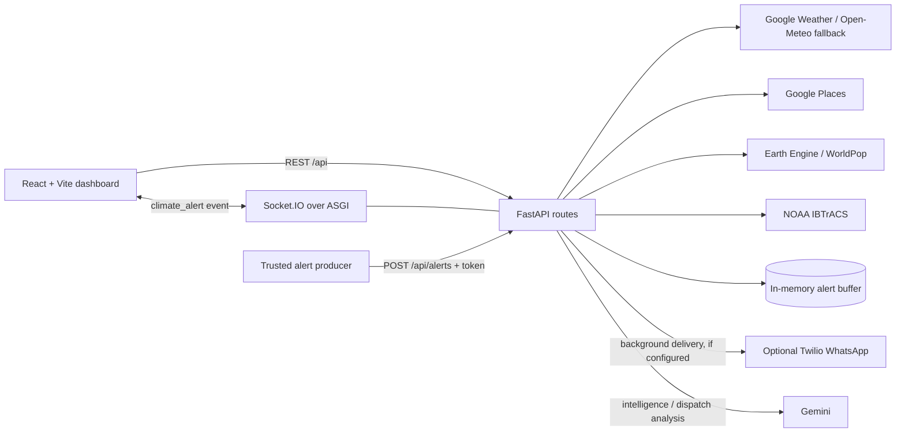
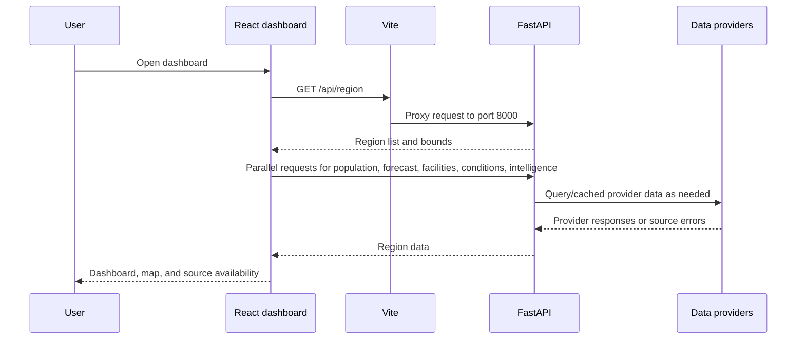
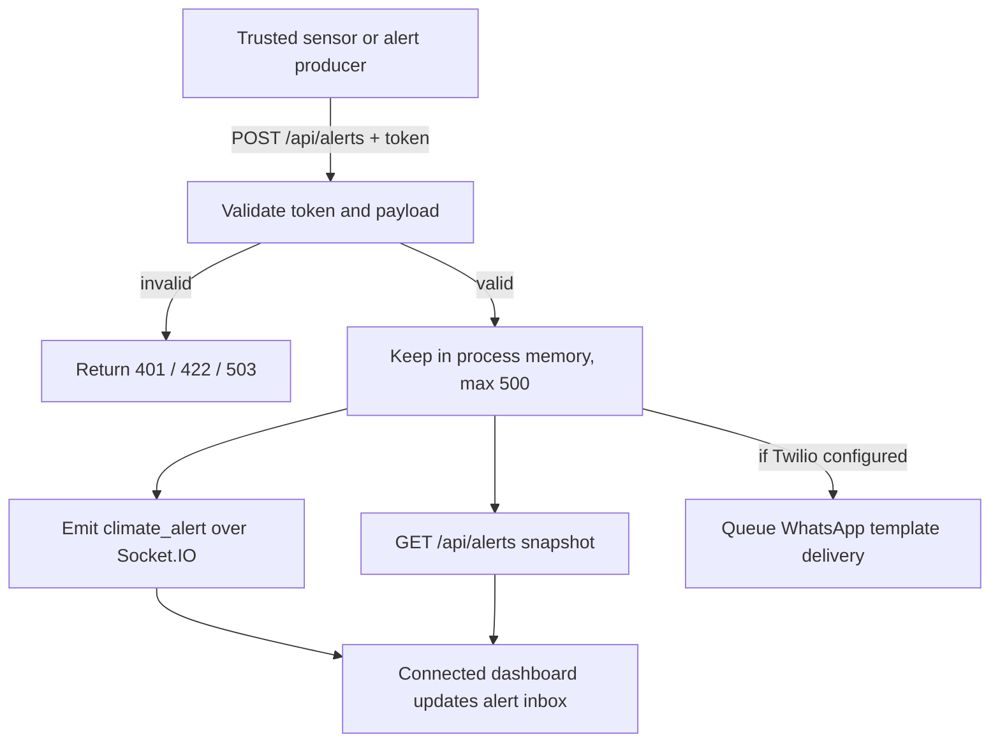

# CIIVF Digital Twin

CIIVF is a coastal climate-risk dashboard prototype for exploring regional weather, nearby critical facilities, population estimates, historical cyclone tracks, and climate alerts. It is a decision-support prototype, not an official warning service or a replacement for government emergency systems.

This repository contains a React/Vite frontend and a Python FastAPI + Socket.IO backend. The frontend calls the backend for data; provider credentials belong on the backend only.

## Contents

- [Architecture](#architecture)
- [Repository layout](#repository-layout)
- [Requirements](#requirements)
- [Quick start on Windows](#quick-start-on-windows)
- [Quick start on macOS or Linux](#quick-start-on-macos-or-linux)
- [Configuration and data providers](#configuration-and-data-providers)
- [Run commands](#run-commands)
- [API reference](#api-reference)
- [Data and alert flows](#data-and-alert-flows)
- [Troubleshooting](#troubleshooting)
- [Known limitations](#known-limitations)

## Architecture



The Vite development server listens on port `3000` and proxies `/api` and `/socket.io` to the backend on port `8000`. The API's interactive documentation is available at `/docs` while the backend is running.

## Repository layout

| Path | Purpose |
| --- | --- |
| `CIIVF-Frontend/` | React 19, TypeScript, Vite, dashboard UI and map |
| `CIIVF-Frontend/src/App.tsx` | Dashboard shell, region selection, page state, data loading |
| `CIIVF-Frontend/src/api.ts` | Typed API requests |
| `CIIVF-Frontend/src/useClimateAlerts.ts` | Alert snapshot, Socket.IO events, unread state |
| `CIIVF-Backend/server.py` | FastAPI routes, alert handling, Socket.IO ASGI app |
| `CIIVF-Backend/ingestion_layer/` | Weather, facilities, population, Earth Engine, NOAA, caching, and intelligence |
| `CIIVF-Backend/whatsapp.py` | Optional Twilio verification and WhatsApp delivery |
| `CIIVF-Backend/utils/list_models.py` | Optional Gemini model-listing utility |
| `PROJECT_OVERVIEW.md` | System overview, current status, and developer handoff |

## Requirements

- Git
- Node.js 22 LTS recommended, with npm
- Python 3.11 recommended (Python 3.10+ is specified by the backend guide)
- Internet access for package installation, provider data, and map tiles
- Optional provider accounts and credentials; see [Configuration and data providers](#configuration-and-data-providers)

## Quick start on Windows

Open **two PowerShell terminals** at the repository root (`C:\node\CIIVF-Monorepo` in this checkout). Keep the backend virtual environment active in the backend terminal.

### 1. Install and start the backend

```powershell
Set-Location C:\node\CIIVF-Monorepo\CIIVF-Backend
py -3.11 -m venv .venv
.\.venv\Scripts\Activate.ps1
python -m pip install --upgrade pip
python -m pip install -r requirements.txt
if (-not (Test-Path .env)) { Copy-Item .env.example .env }
```

Edit `CIIVF-Backend/.env` and add the provider credentials you need. Do not overwrite an existing `.env`. Then start the API:

```powershell
python -m uvicorn server:app --reload --host 127.0.0.1 --port 8000
```

If PowerShell blocks environment activation, allow scripts only in this terminal and activate again:

```powershell
Set-ExecutionPolicy -Scope Process -ExecutionPolicy Bypass
.\.venv\Scripts\Activate.ps1
```

### 2. Install and start the frontend

In the second terminal:

```powershell
Set-Location C:\node\CIIVF-Monorepo\CIIVF-Frontend
npm install --legacy-peer-deps
npm run dev
```

Open the local URL Vite prints (normally `http://localhost:3000`). If port `3000` is busy, Vite may choose the next free port. The backend should be available at `http://127.0.0.1:8000`.

## Quick start on macOS or Linux

Use two terminals from the repository root. For the backend:

```bash
cd CIIVF-Backend
python3 -m venv .venv
source .venv/bin/activate
python -m pip install --upgrade pip
python -m pip install -r requirements.txt
test -f .env || cp .env.example .env
```

Configure `CIIVF-Backend/.env`, then run:

```bash
python -m uvicorn server:app --reload --host 127.0.0.1 --port 8000
```

In the second terminal:

```bash
cd CIIVF-Frontend
npm install --legacy-peer-deps
npm run dev
```

Open the URL printed by Vite, normally `http://localhost:3000`.

## Configuration and data providers

Backend variables are documented in `CIIVF-Backend/.env.example`. Put secrets only in `CIIVF-Backend/.env`; never put provider keys or the alert-ingestion token in frontend variables.

| Variable | Needed for | Notes |
| --- | --- | --- |
| `GOOGLE_MAPS_API_KEY` | Google Weather and Google Places | Enable the required APIs, billing, and suitable key restrictions. Weather has an Open-Meteo fallback; Places does not. |
| `GEE_PROJECT_ID` | Earth Engine and WorldPop population | Set up an Earth Engine-enabled Google Cloud project and authenticate the account used by the backend. |
| `GEMINI_API_KEY` | Disaster-intelligence and dispatch generation; model-list utility | Server-side only. Provider output is not an official warning or verified route. |
| `ALERT_INGEST_TOKEN` | `POST /api/alerts` | Long random secret, sent only by a trusted backend producer in `X-Alert-Ingest-Token`. |
| `TWILIO_ACCOUNT_SID`, `TWILIO_AUTH_TOKEN` | Optional WhatsApp delivery | Keep private and server-side. |
| `TWILIO_VERIFY_SERVICE_SID` | Optional WhatsApp opt-in/opt-out verification | Configure a Verify Service with WhatsApp enabled. |
| `TWILIO_MESSAGING_SERVICE_SID` | Optional WhatsApp notifications | Messaging Service must have an approved WhatsApp sender. |
| `TWILIO_WHATSAPP_CONTENT_SID` | Optional WhatsApp notifications | SID for the approved content template. |
| `WHATSAPP_DATABASE_PATH` | Optional subscriber database location | Defaults to the ignored `.local/whatsapp.sqlite3` under the backend directory. |

Earth Engine authentication is normally a one-time step for the developer account. Run this with the backend virtual environment active:

```powershell
earthengine authenticate
```

On macOS/Linux, use the same command after activating the environment. Backend startup can continue if Earth Engine initialization fails, but population and ingestion-dependent features may report unavailable data.

The frontend optionally accepts `VITE_API_BASE_URL` and `VITE_SOCKET_URL`. Defaults are `/api` and the browser's current origin; the Vite development proxy handles both paths. For a different deployment, configure these values at frontend build time and provide a backend/reverse-proxy setup that supports REST and Socket.IO.

## Run commands

Run frontend commands from `CIIVF-Frontend/`:

| Command | What it does |
| --- | --- |
| `npm run dev` | Start Vite development server on port `3000` |
| `npm run lint` | Type-check TypeScript with `tsc --noEmit` |
| `npm run build` | Create the production bundle in `dist/` |
| `npm run preview` | Preview the built frontend locally; this does not provide the development API proxy |
| `npm run clean` | Remove frontend `dist/` and `server.js` (uses `rm -rf`, so it is intended for Unix-like shells) |

For example, after building, run `npm run preview -- --host 127.0.0.1`. Production preview requires a backend URL/reverse proxy if the app should load live API data.

Run backend commands from `CIIVF-Backend/` with `.venv` activated:

```powershell
# Start API with reload
python -m uvicorn server:app --reload --host 127.0.0.1 --port 8000

# Compile/check backend Python modules
python -m py_compile server.py whatsapp.py ingestion_layer\constant.py ingestion_layer\population.py ingestion_layer\places.py ingestion_layer\weather.py ingestion_layer\disaster_history.py ingestion_layer\disaster_intelligence.py ingestion_layer\index.py

# Optional: run the batch ingestion entry point (currently defaults to odisha)
python -m ingestion_layer.index

# Optional: list Gemini models (requires GEMINI_API_KEY)
python utils\list_models.py
```

The batch ingestion command calls external providers and writes cached JSON/image files under `CIIVF-Backend/data/ingested/`. It is not required to start the web dashboard. There is no committed automated test suite at this time.

## API reference

All region-aware endpoints use the keys returned by `GET /api/region`. Current keys are `vizag`, `odisha`, `chennai`, `bengal`, `gujarat`, `paradip`, `gopalpur`, `kakinada`, `mumbai`, and `bay_of_bengal`.

| Method | Path | Description |
| --- | --- | --- |
| `GET` | `/api/health` | Backend health check |
| `GET` | `/api/region` | Region names and map bounds |
| `GET` | `/api/population?region=vizag` | WorldPop/Earth Engine population estimate |
| `GET` | `/api/shelter?region=vizag` | Nearby hospitals and shelters from Places |
| `GET` | `/api/current-conditions?region=vizag` | Current weather conditions |
| `GET` | `/api/forecast?region=vizag` | Seven-day weather forecast; legacy `/api/forcast` alias also exists |
| `GET` | `/api/history?region=vizag` | NOAA historical cyclone analogs |
| `GET` | `/api/disaster-intelligence/{region}` | Ingestion-backed risk screening and AI analysis |
| `GET` | `/api/alerts?limit=100` | Recent non-simulation alerts (maximum 500) |
| `POST` | `/api/alerts` | Validate and broadcast a trusted climate alert; requires ingest token |
| `POST` | `/api/simulator/alerts` | Create a clearly labeled local simulation alert; loopback requests only |
| `GET` | `/api/whatsapp/configuration` | Report whether WhatsApp verification/delivery is configured |
| `POST` | `/api/whatsapp/verification/start` | Request WhatsApp OTP; phone must be E.164 format |
| `POST` | `/api/whatsapp/verification/check` | Verify OTP and subscribe or unsubscribe |
| `POST` | `/api/dispatch-chat` | Experimental Gemini dispatch response; see limitations below |

FastAPI Swagger docs: `http://127.0.0.1:8000/docs`. ReDoc: `http://127.0.0.1:8000/redoc`.

### Smoke checks (PowerShell)

With the backend running in another terminal:

```powershell
Invoke-RestMethod http://127.0.0.1:8000/api/health
Invoke-RestMethod http://127.0.0.1:8000/api/region
Invoke-RestMethod "http://127.0.0.1:8000/api/forecast?region=vizag"
```

You can also open `http://127.0.0.1:8000/docs` to inspect and try the available endpoints.

### Submit a local simulator alert

In the frontend, open the simulator workflow and broadcast a `YELLOW`, `ORANGE`, or `RED` exercise alert. The API rejects simulator broadcasts from non-loopback clients. These are test alerts, not live warnings. Alternatively:

```powershell
$body = @{
  region_key = "vizag"
  tier = "YELLOW"
  ward = "Local test ward"
} | ConvertTo-Json

Invoke-RestMethod `
  -Uri "http://127.0.0.1:8000/api/simulator/alerts" `
  -Method Post `
  -ContentType "application/json" `
  -Body $body
```

### Submit a trusted climate alert

Configure `ALERT_INGEST_TOKEN` in the backend `.env`, restart the backend, then set the same value in a trusted producer terminal. Do not use or expose this secret in browser code.

```powershell
$env:ALERT_INGEST_TOKEN = "your-local-test-secret"
$body = @{
  hazard_type = "heavy_rain"
  severity = "high"
  title = "Heavy rainfall threshold exceeded"
  description = "Rainfall exceeded the configured local test threshold."
  location = @{
    name = "Visakhapatnam"
    region_key = "vizag"
    latitude = 17.6868
    longitude = 83.2185
  }
  source = "local-test-producer"
  measurements = @{ rainfall_mm_per_hour = 82.5 }
} | ConvertTo-Json -Depth 6

Invoke-RestMethod `
  -Uri "http://127.0.0.1:8000/api/alerts" `
  -Method Post `
  -Headers @{ "X-Alert-Ingest-Token" = $env:ALERT_INGEST_TOKEN } `
  -ContentType "application/json" `
  -Body $body
```

## Data and alert flows

### Start and load a region



Weather may fall back to Open-Meteo if Google Weather is unavailable. Historical tracks use NOAA IBTrACS; facilities use Google Places; population uses Earth Engine/WorldPop. Source failures should be treated as unavailable data, not as evidence of zero risk.

### Alert ingestion and browser delivery



Alert records live only in process memory and disappear when the backend restarts. WhatsApp is optional and requires verified subscriber opt-in; the alert feed does not depend on it.

## Troubleshooting

| Symptom | Check |
| --- | --- |
| Frontend cannot load data | Confirm backend is running on port `8000`; try `http://127.0.0.1:8000/api/health`. |
| Browser cannot connect to Socket.IO | Keep the Vite proxy enabled and verify `/socket.io` reaches port `8000`; check the browser console and backend logs. |
| `npm install` reports peer dependency resolution errors | Use `npm install --legacy-peer-deps`, as the frontend guide specifies. |
| No population estimate | Set `GEE_PROJECT_ID`, enable/authenticate Earth Engine, and inspect the API response for `source_error`. |
| Weather or forecast unavailable | Check `GOOGLE_MAPS_API_KEY`, Google Weather API access/billing, outbound network, or the fallback provider response. |
| No facilities returned | Check Google Places API access; results are limited to a five-kilometre radius and may be empty for offshore regions. |
| Historical results take time | The first cold request downloads the NOAA North Indian Ocean archive; data is cached in process for six hours. |
| Alert POST returns `503` | Set `ALERT_INGEST_TOKEN` and restart the backend. |
| Alert POST returns `401` | Ensure the `X-Alert-Ingest-Token` exactly matches the backend secret. |
| WhatsApp verification unavailable | Configure Twilio Verify separately from Messaging Service/template delivery; inspect `/api/whatsapp/configuration`. |

## Known limitations

- The dashboard is a prototype, not an official warning service. Several operational screens contain simulated or unavailable workflows.
- The dispatch endpoint is experimental. Its prompt uses `query` for the origin and does not currently use the request's `current_location` field. It also reads a `shelter` key while batch ingestion returns a `places` key, so facility context can be empty until that integration is reconciled. Gemini credentials and working provider ingestion are required.
- Disaster-intelligence output is screening/analysis, not an official warning or a validated evacuation route. AI-generated descriptions must not be treated as operationally verified measurements or directions.
- Alerts are stored in a bounded in-memory buffer, with no durable alert history, acknowledgement workflow, or delivery audit trail.
- Frontend login/profile state is local prototype state, not authentication or authorization. Read APIs and production alert ingestion need an appropriate security model.
- Development CORS includes permissive origins. Restrict origins, add authentication/rate limits, and configure production secrets before deployment.
- Population requires Earth Engine setup. Google Weather/Places access, OpenStreetMap tile access, and NOAA downloads require network/provider availability.
- There is no committed automated backend test suite. `npm run lint`, `npm run build`, and the backend `py_compile` command are the current basic local checks.

## More detail

- [Project overview and developer handoff](PROJECT_OVERVIEW.md)
- [Backend setup, providers, and WhatsApp configuration](CIIVF-Backend/README.md)
- [Frontend details and troubleshooting](CIIVF-Frontend/README.md)